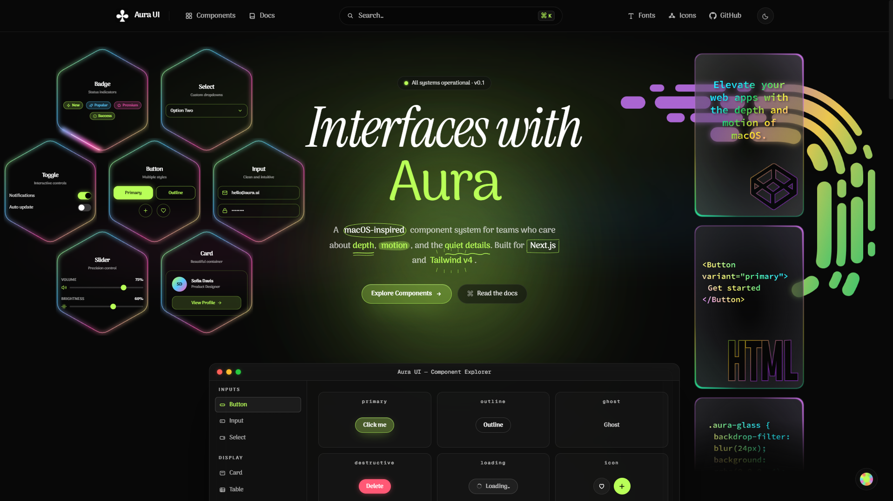
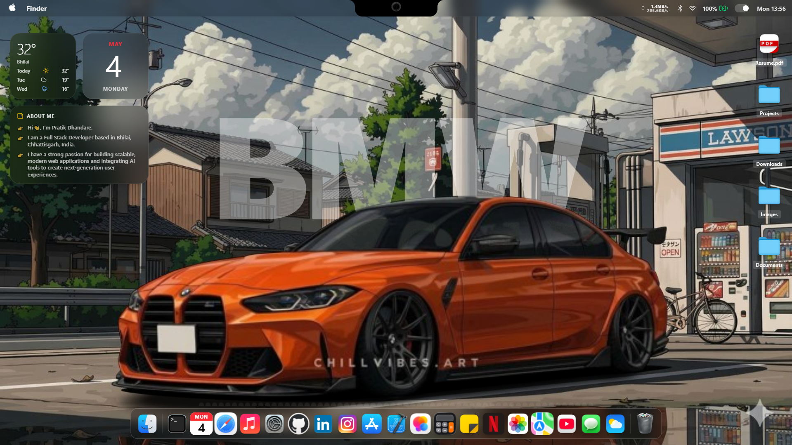
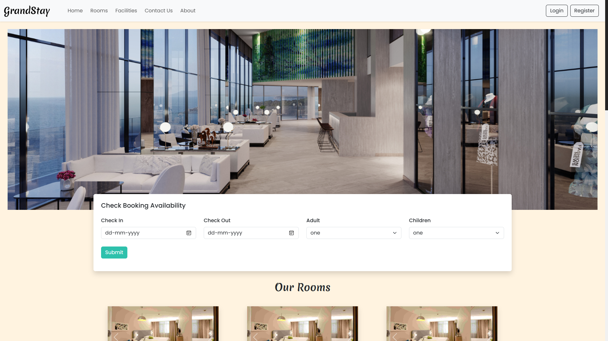
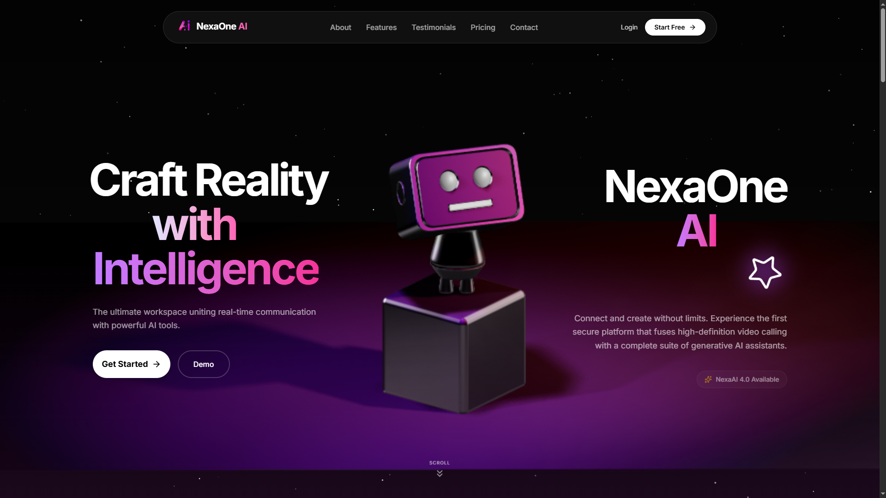

  

####
<h3 align="center">

</h3>

<h2 align="center">Hey 👋! My name is Pratik and I'm a Web Developer..., from India...and curious about learning new skills and technology..</h1>

####
<h3 align="center">

</h3>

                                  

####
<h3 align="center">

</h3>

  <h2>App Screenshots</h2>
  

    
    
    
    
  

 

<picture>
  <source media="(prefers-color-scheme: dark)" srcset="https://raw.githubusercontent.com/Code2With-Pratik/Code2With-Pratik/output/pacman-contribution-graph-dark.svg">
  <source media="(prefers-color-scheme: light)" srcset="https://raw.githubusercontent.com/Code2With-Pratik/Code2With-Pratik/output/pacman-contribution-graph.svg">
  
</picture>

